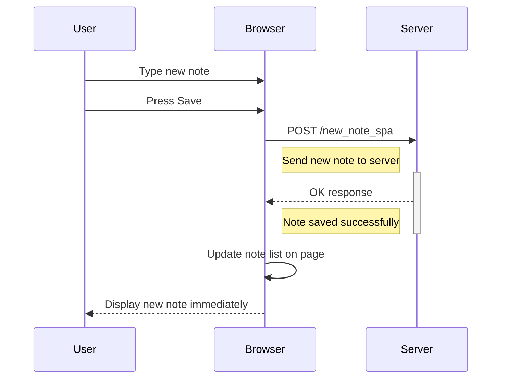

# Exercise 0.6: New Note

```mermaid
sequenceDiagram
    participant U as User
    participant B as Browser
    participant S as Server

    U->>B: Type new note
    U->>B: Press Save
    
    B->>S: POST /new_note_spa
    Note right of B: Send new note to server
    activate S
    
    S-->>B: OK response
    Note left of S: Note saved successfully
    deactivate S
    
    B->>B: Update note list on page
    B-->>U: Display new note immediately
```
