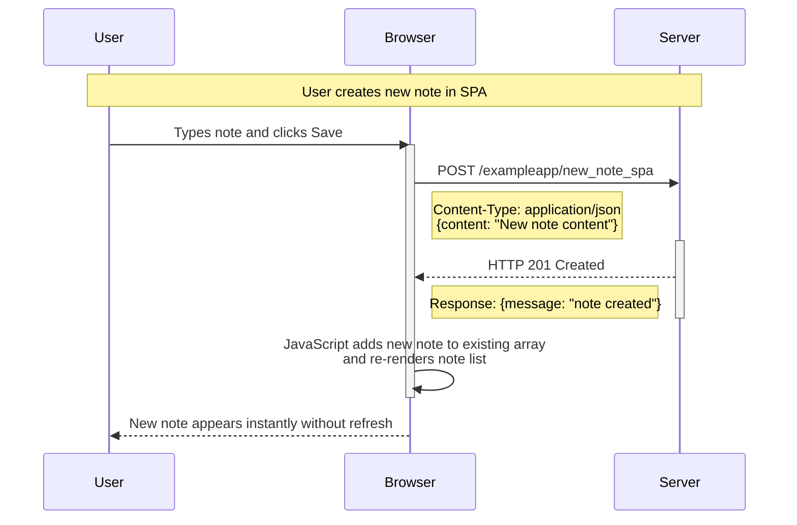

# Exercise 0.6: New Note (SPA)

```mermaid
sequenceDiagram
    participant User
    participant Browser
    participant Server

    Note over User, Server: User creates new note in SPA

    User->>Browser: Types note and clicks Save
    activate Browser
    
    Browser->>Server: POST /exampleapp/new_note_spa
    Note right of Browser: Content-Type: application/json<br>{content: "New note content"}
    activate Server
    
    Server-->>Browser: HTTP 201 Created
    Note left of Server: Response: {message: "note created"}
    deactivate Server
    
    Browser->>Browser: JavaScript adds new note to existing array<br>and re-renders note list
    deactivate Browser
    
    Browser-->>User: New note appears instantly without refresh
```